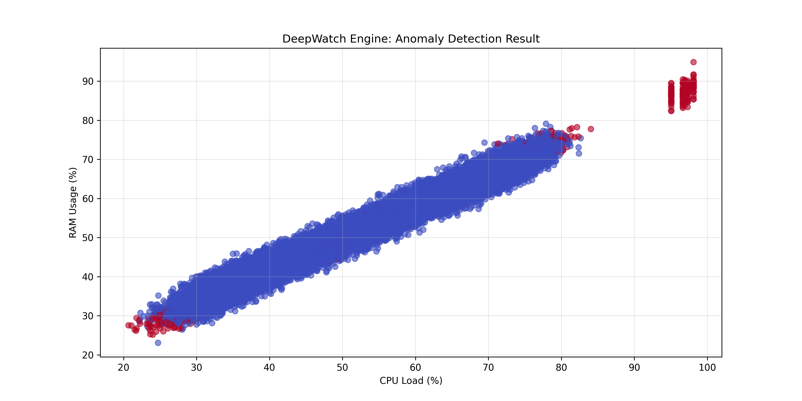

# 🛰️ DeepWatch Engine

## 📊 Analytics Insight

**Intelligent IT infrastructure monitoring with Big Data & Machine Learning.**

## 📌 Project Overview
DeepWatch is an analytical engine designed to detect anomalies in server telemetry (CPU, RAM). 
Instead of rigid thresholds, it uses **Isolation Forest** to understand the "context" of data.

## 🛠️ Tech Stack
- **Language:** Python 3.11+
- **Data Engine:** DuckDB (High-performance SQL)
- **ML Framework:** Scikit-learn (Isolation Forest)
- **Storage:** Apache Parquet
- **Architecture:** OOP-based Modular Pipeline

## 🚀 How it works
1. **Generation:** Simulates realistic server load with seasonality and hidden anomalies.
2. **Feature Engineering:** Uses SQL (Window Functions) to prepare data for ML.
3. **Detection:** Trains a model to identify outliers in a 4D feature space.
4. **Persistence:** Saves results to Parquet reports and exports trained model weights.
